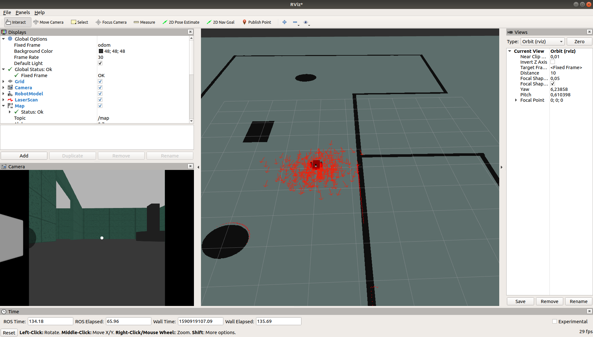

# where_am_i

Implemented the robot localization package

Initial pose on launching amcl package
--------------------------------------

Acceptance criteria
--------------------
Your Localization ROS Workspace folder
Screenshot(s) of your robot localizing in the simulation
